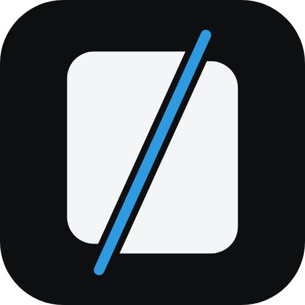

<p align="center">
  
</p>

<h1 align="center">VideoGPT Studio</h1>

<p align="center">
  A render service and editor for short vertical video.
</p>

---

You give it an edit document (a video plus cuts, a set of scenes, captions) and it gives you
back an mp4. It also has a small web editor to build that document by hand.

It does not find moments or transcribe. Something upstream decides what to render and hands
this service the command. This service turns that command into video.

It renders two ways:

- **ffmpeg** for plain work: trim a clip, crop or scale it to a format. Fast, no browser.
- **Remotion** for composed work: burned captions, layered scenes, assembling generated
  story videos. Slower, runs headless Chromium.

A router picks the fast lane when the job allows it and the rich lane otherwise. Both render
from the same composition code the web editor previews, so the preview matches the output.

## Packages

| Path | Name | What it is |
|---|---|---|
| `packages/vcs-remotion` | `@vcs/remotion` | the compositions (clip, captioned, story) and the edit document they share |
| `apps/vcs-editor-service` | `vcs-editor-service` | the render server and the web editor |

The compositions are their own package so a UI can preview them without pulling in the render
server. The dashboards do exactly that.

## Run

Node 20 or newer, and pnpm.

```sh
pnpm install
pnpm -C apps/vcs-editor-service dev        # render API on :3000
pnpm -C apps/vcs-editor-service web:dev     # editor on :5180
```

POST an edit document, get an mp4. It runs on its own, with no backend behind it. The
endpoints and settings are in `apps/vcs-editor-service/README.md`.

## License

The code here is [MIT](LICENSE). It uses Remotion and ffmpeg, which have their own terms. If
you run it as a business, read [NOTICE.md](NOTICE.md) first. Remotion is free for individuals
and companies up to three people and paid above that, and that cost is on whoever runs it.
